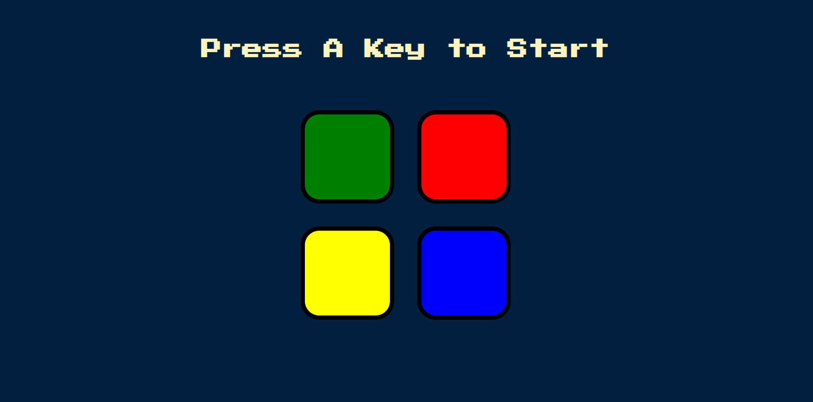

<h1 align="center"> Projeto com JavaScript </h1>

# 🖥️ Simon Game

O Simon Game é uma versão digital do clássico jogo de memória "Simon". Este projeto foi desenvolvido usando tecnologias frontend.

## 📝 Descrição

O jogo de Simon é um clássico jogo de memória no qual os jogadores precisam lembrar e repetir sequências de cores e sons. Este projeto fornece uma versão digital do jogo para entretenimento e melhoria da memória.

## 👨‍💻 Tecnologias
Esse projeto foi desenvolvido utilizando as seguintes tecnologias:
- HTML
- CSS
- JAVASCRIPT

## Funcionalidades

- Jogabilidade interativa
- Geração aleatória de sequências de cores
- Efeitos sonoros para cada cor
- Animação de fim de jogo e funcionalidade de reinício